# DisentanglingSequences
In the interests of reproducibility, this repository contains instructions and code for a release version of the work on hierarchical state space models for video disentanglement (VDSM)

##  Generation Samples

Note that these are random samples from the test set, so there may be inactive GIFs if the action is neutral.

Pendulum swings (60 timesteps)

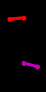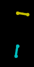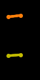

MovingMNIST [3] (16 timesteps)

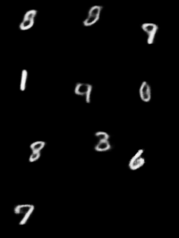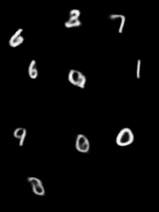


Animated Sprites [1] (8 timesteps)

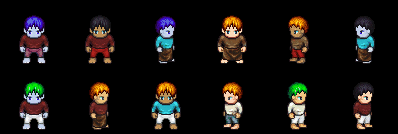
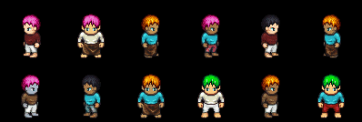
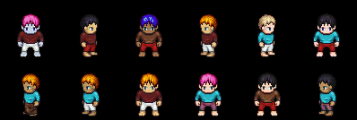

Animated Sprites Action Transfer (first column is target action):

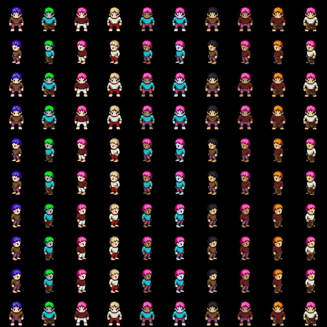

MUG-FED [2] (20 timesteps)

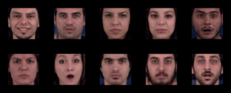

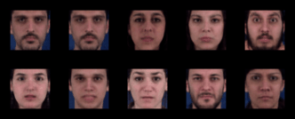

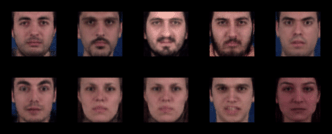

MUG-FED Action Transfer (first column is target action):

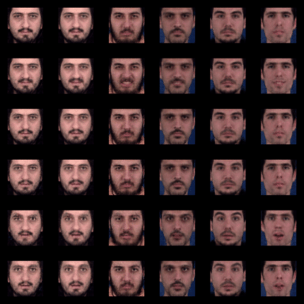

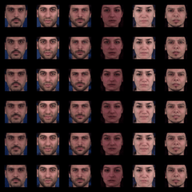


## Required Packages/Libraries
python 3.7.6

numpy 1.19.2

pandas 1.0.5

torch 1.6.0

torchvision 0.7.0

pyro 1.4.0

sklearn 0.23.2

imageio 2.9.0

scipy 1.5.3

pytz 2020.1

natsort 7.0.1 

datetime

antialiased_cnns

nonechucks

os
argparse


##  Instructions
N.B. Currently, VDSM is designed to train on GPU.

### 0. Download and preprocess MUG-FED dataset

MUG:
Go to https://mug.ee.auth.gr/fed/ and obtain a license.

Use OpenFace 2.0, https://github.com/TadasBaltrusaitis/OpenFace, to crop and align the images (no mask) to 112x112x3
(VDSM does further downscaling to 64x64). 

Save the images into a npz with ndarray of shape [num_sequences_in_dataset] 
such that each sequence has a shape of [seq_len, 112, 112, 3].

Save the labels into a npz array with shape [num_sequences_in_dataset, 2] where the first column is identity label
and the second column is the action label (and where both have been categorically encoded e.g. action {0,1...8}).

Put these files in VDSM_release/data/MUG-FED/

SPRITES:
For sprites, additional packages may be required (check ```create_lpc_dataset.py``` which is adapted from https://github.com/yatindandi/Disentangled-Sequential-Autoencoder).

```cd ./data/sprites```

```./data/sprites/create_lpc_dataset.py``` 

This will download the sprites data into train and test folders.

PENDULUM:
The code used to create this data is provided in ```./data/pendulum_data_creation.ipynb```
### 1. Train the Encoder/Decoder
```cd VDSM_release```
 
MUG:
```
python3 main.py --RUN release_test --rnn_layers 3 --rnn_dim 512 --bs 20 --seq_len 20 --epochs 250 --bs_per_epoch 50 \
 --num_test_ids 10 --dataset_name MUG-FED --model_save_interval 50  \
    --train_VDSMSeq False --train_VDSMEncDec True --model_test_interval 10  \
  --anneal_start_dynamics 0.1 --anneal_end_dynamics 0.6 --anneal_frac_dynamics 1  --lr_VDSMEncDec 0.001 --lr_resume 0.0008  --z_dim 30 --n_e_w 15 \
  --dynamics_dim 50 --test_temp_id 10  --temp_id_end 10 --temp_id_start 1 --temp_id_frac 2 --anneal_end_id 1 --anneal_start_id 0.1 \
    --anneal_frac_id 3 --anneal_start_t 30.0 --anneal_mid_t1 0.2 --anneal_mid_t2 0.4 --anneal_end_t 1 --anneal_t_midfrac1 0.5 --anneal_t_midfrac2 0.8 \
    --rnn_dropout 0.2
```

Sprites:
```
python3 main.py --RUN release_test_sprites --rnn_layers 3 --rnn_dim 512 --bs 20 --seq_len 16 --epochs 200 --bs_per_epoch 50 \
 --num_test_ids 12 --dataset_name sprites --model_save_interval 50  \
    --train_VDSMSeq False --train_VDSMEncDec True --model_test_interval 10  \
  --anneal_start_dynamics 0.1 --anneal_end_dynamics 0.6 --anneal_frac_dynamics 1  --lr_VDSMEncDec 0.001 --lr_resume 0.0008  --z_dim 30 --n_e_w 40 \
  --dynamics_dim 50 --test_temp_id 10  --temp_id_end 10 --temp_id_start 1 --temp_id_frac 2 --anneal_end_id 1 --anneal_start_id 0.1 \
    --anneal_frac_id 3 --anneal_start_t 30.0 --anneal_mid_t1 0.2 --anneal_mid_t2 0.4 --anneal_end_t 1 --anneal_t_midfrac1 0.5 --anneal_t_midfrac2 0.8 \
    --rnn_dropout 0.2
```


If you encounter NaN during training, you can try resuming from where you last checkpointed at (this is taken care of automatically).

You need to manually delete the model.pth files in the models folder if you want to start training from scratch.

If you get NaN again, you can add e.g. ```--lr_resume 0.0008``` argument to reduce the learning rate.


### 2. Train the Sequential Network

To train the sequence network, you have to specify the {}_VDSM_EncDec.pth number to use as the pretrained model.
(Usually it will be (epochs-1) for the number of epochs used during pretraining)

MUG:
```
python3 main.py --RUN release_test --rnn_layers 3 --rnn_dim 512 --bs 20 --seq_len 20 --epochs 200 --bs_per_epoch 2 \
 --num_test_ids 6 --dataset_name MUG-FED --model_save_interval 50 --pretrained_model_VDSMEncDec 249\
    --train_VDSMSeq True --train_VDSMEncDec False --model_test_interval 10  \
   --anneal_start_dynamics 0.1 --anneal_end_dynamics 1.0 --anneal_frac_dynamics 1   --lr_VDSMSeq 0.001 --z_dim 30 --n_e_w 15 \
--dynamics_dim 50 --test_temp_id 10.0 --temp_id_end 10.0 --temp_id_start 10.0 --temp_id_frac 1 --anneal_end_id 1.0 --anneal_start_id .1 \
    --anneal_frac_id 3 --anneal_start_t 0.1 --anneal_mid_t1 0.4 --anneal_mid_t2 0.4 --anneal_end_t 1 --anneal_t_midfrac1 0.5 --anneal_t_midfrac2 0.8  \
    --rnn_dropout 0.2
```

SPRITES
```
python3 main.py --RUN release_test_sprites --rnn_layers 3 --rnn_dim 512 --bs 20 --seq_len 8 --epochs 200 --bs_per_epoch 50 \
 --num_test_ids 12 --dataset_name sprites --model_save_interval 50 --pretrained_model_VDSMEncDec 199\
    --train_VDSMSeq True --train_VDSMEncDec False --model_test_interval 10  \
   --anneal_start_dynamics 0.1 --anneal_end_dynamics 1.0 --anneal_frac_dynamics 1   --lr_VDSMSeq 0.001 --z_dim 30 --n_e_w 40 \
--dynamics_dim 50 --test_temp_id 10.0 --temp_id_end 10.0 --temp_id_start 10.0 --temp_id_frac 1 --anneal_end_id 1.0 --anneal_start_id .1 \
    --anneal_frac_id 3 --anneal_start_t 0.1 --anneal_mid_t1 0.4 --anneal_mid_t2 0.4 --anneal_end_t 1 --anneal_t_midfrac1 0.5 --anneal_t_midfrac2 0.8  \
    --rnn_dropout 0.2
```

Testing: just set both train_VDSMSeq and train_VDSMEncDec to False.
  
#### FID information:
For FID we used Evan: https://github.com/raahii/evan

and the ```resnext-101-kinetics.pth``` model and code available from https://github.com/kenshohara/video-classification-3d-cnn-pytorch
(you may need to download this model and put it in the hidden folder ```.evan/```.

To reproduce the results, you may need to replace the ```prepare_inception_model``` function in the ```evan``` package with:

```python
def prepare_inception_model(weight_dir: Path = CACHE_DIR, device: torch.device = torch.device("cpu")):
    filename = "resnext-101-kinetics.pth"
    weight_path = weight_dir / filename

    model = resnet.resnet101(num_classes=400, shortcut_type='B', cardinality=32,
                                      sample_size=112, sample_duration=16,
                                      last_fc=False)

    model_data = torch.load(str(weight_path), map_location="cpu")
    fixed_model_data = OrderedDict()
    for key, value in model_data["state_dict"].items():
        new_key = key.replace("module.", "")
        fixed_model_data[new_key] = value

    model.load_state_dict(fixed_model_data, strict=False)
    model = model.to(device)
    model.eval()

    return model
```

You may also need to replace the code for ```resnet.resnet101``` model with the model in https://github.com/kenshohara/video-classification-3d-cnn-pytorch

### Classification Consistency, Inter/Intra Entropy

For this we adapted the code from # see https://github.com/yatindandi/Disentangled-Sequential-Autoencoder/blob/master/classifier.py

It can be found in ``` classifier_MUG.ipynb``` and ```classifier_sprites.ipynb```.

To use these, you need to export the embeddings learned by the model using functions like these:

```python
    def extract_id_etc(self, test_images):  # test images is shape [bs, seq_len, 3, 64, 64]
        num_individuals, num_timepoints, pixels = (test_images.shape[0],
                                                   test_images.shape[1],
                                                   self.imsize ** 2 * self.nc)

        unrav = test_images.view(num_individuals * num_timepoints, self.nc, self.imsize, self.imsize)
        loc, _, ID, ID_scale = self.VDSM_Seq.image_enc.forward(unrav.to(self.dev))
        loc = loc.view(num_individuals, num_timepoints, -1)
        ID, _ = self.id_layers(ID, ID_scale)
        ID = torch.mean(ID.view(num_individuals, num_timepoints, -1), 1).unsqueeze(1)
        ID = ID * self.temp_id_end
        ID_exp = torch.exp(ID)
        ID = ID_exp / ID_exp.sum(-1).unsqueeze(-1)
        seq = loc.permute(1, 0, 2)
        return ID, seq, num_individuals, num_timepoints, pixels


    def generate_sequences(self, test_images):  # test images is shape [bs, seq_len, 3, 64, 64]
        ID, seq, num_individuals, num_timepoints, pixels = self.extract_id_etc(test_images)

        futures = self.VDSM_Seq.test_sequence(seq, num_timepoints).permute(1, 0, 2)

        recon_gen = torch.zeros(num_individuals, num_timepoints, pixels, device=test_images.device)

        for ind in range(num_individuals):
            recon_gen[ind] = self.VDSM_Seq.image_dec.forward(futures[ind], ID[ind, 0].unsqueeze(1))
        recon_gen = recon_gen.view(num_individuals, num_timepoints, self.nc, self.imsize, self.imsize)
        return recon_gen

    def generate_codes(self, test_images, labels, p):  # test images is shape [bs, seq_len, 3, 64, 64] 
        ID, seq, num_individuals, num_timepoints, pixels = self.extract_id_etc(test_images)
        dynamics = self.VDSM_Seq.return_dynamics(seq).detach().cpu().numpy()
        recon_gen = self.generate_sequences(test_images).detach().cpu().numpy()
        
        np.savez(os.path.join(self.code_path, 'id_{}.npz'.format(p)), ID.detach().cpu().numpy())
        if labels is not None:
            np.savez(os.path.join(self.code_path, 'labels_{}.npz'.format(p)), labels)
        np.savez(os.path.join(self.code_path, 'dynamics_{}.npz'.format(p)), dynamics)
        np.savez(os.path.join(self.code_path, 'test_images_{}.npz'.format(p)), test_images.detach().cpu().numpy())
        np.savez(os.path.join(self.code_path, 'recon_images_{}.npz'.format(p)), recon_gen)       
```

These have not yet be integrated into the release code (see TODO below).

## TODO: 
- Consolidate repeated functions.
- Create test_harness.py and consolidate with train_test.py
- Add pendulum dataset
- Add moving MNIST dataset
- Adapt for CPU training
- Implement Inter and Intra-Entropy for sprites
- Implement test harness


##  References

[1] http://gaurav.munjal.us/Universal-LPC-Spritesheet-Character-Generator/

[2] N. Aifanti, C. Papachristou, and A. Delopoulos. The MUG facial  expression  database.Proc.  11th  Int.  Workshop  on Image Analysis for Multimedia Interactive Services, 2010.

[3] Srivastava,  E.  Mansimov,  and  R.  Salakhutdinov. Un-supervised  learning  of  video  representations  using  LSTMs. arXiv:1502.04681v3, 2016.

