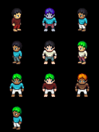

# DisentanglingSequences
Repo for the work on hierarchical state space models for disentanglement

##  Generation Samples

Note that these are random samples, so there may be inactive GIFs if the action is neutral.

Pendulum swings (60 timesteps)

  

Animated Sprites [1] (8 timesteps)




MUG-FED [2] (16 timesteps)


## Required Packages/Libraries
python 3.7.6

numpy 1.19.2

pandas 1.0.5

torch 1.6.0

torchvision 0.7.0

pyro 1.4.0

sklearn 0.23.2

imageio 2.9.0

scipy 1.5.3

pytz 2020.1

natsort 7.0.1 

datetime

antialiased_cnns

nonechucks

os
argparse


##  Instructions
```cd VDSM_release```

### 0. Download and preprocess MUG-FED dataset
Go to https://mug.ee.auth.gr/fed/ and obtain a license.

Use OpenFace 2.0, https://github.com/TadasBaltrusaitis/OpenFace, to crop and align the images (no mask) to 112x112x3
(VDSM does further downscaling to 64x64). 

Save the images into a npz with ndarray of shape [num_sequences_in_dataset] 
such that each sequence has a shape of [seq_len, 112, 112, 3].

Save the labels into a npz array with shape [num_sequences_in_dataset, 2] where the first column is identity label
and the second column is the action label (and where both have been categorically encoded e.g. action {0,1...8}).

Put these files in VDSM_release/data/MUG-FED/


### 1. Train the Encoder/Decoder

Run this:
```
    python3 main.py --RUN release_test --rnn_layers 3 --rnn_dim 512 --bs 50 --seq_len 16 --epochs 200 --bs_per_epoch 50 \
 --num_test_ids 6 --dataset_name MUG-FED --model_save_interval 2 --num_test_ids 2 \
    --train_VDSMSeq False --train_VDSMEncDec True --model_test_interval 2  \
  --anneal_start_dynamics 0.1 --anneal_end_dynamics 0.6 --anneal_frac_dynamics 1  --lr_VDSMEncDec 0.0005  --likelihood Bernoulli --z_dim 30 --n_e_w 15 \
  --dynamics_dim 50 --test_temp_id 10  --temp_id_end 10 --temp_id_start 1 --temp_id_frac 2 --anneal_end_id 1 --anneal_start_id 0.1 \
    --anneal_frac_id 3 --anneal_start_t 30.0 --anneal_mid_t1 0.4 --anneal_mid_t2 0.4 --anneal_end_t 1 --anneal_t_midfrac1 0.5 --anneal_t_midfrac2 0.8 \
    --rnn_dropout 0.2
```

If you encounter NaN during training, you can try resuming from where you last checkpointed at (this is taken care of automatically).

You need to manually delete the model.pth files in the models folder if you want to start training from scratch.

If you get NaN again, you you use the ```--lr_resume``` argument to reduce the learning rate.


### 2. Train the Sequential Network

To train the sequence network, you have to specify the {}_VDSM_EncDec.pth number to use as the pretrained model.
(Usually it will be (epochs-1) for the number of epochs used during pretraining)
```
    python3 main.py --RUN release_test --rnn_layers 3 --rnn_dim 512 --bs 50 --seq_len 16 --epochs 100 --bs_per_epoch 50 \
 --num_test_ids 6 --dataset_name MUG-FED --model_save_interval 20 --num_test_ids 2 --pretrained_model_VDSMEncDec 199\
    --train_VDSMSeq True --train_VDSMEncDec False --model_test_interval 10  \
  --anneal_start_dynamics 0.1 --anneal_end_dynamics 0.6 --anneal_frac_dynamics 1  --lr_VDSMSeq 0.001  --likelihood Bernoulli --z_dim 30 --n_e_w 15 \
  --dynamics_dim 50 --test_temp_id 9.95  --temp_id_end 10.0 --temp_id_start 1 --temp_id_frac 3 --anneal_end_id 1 --anneal_start_id 0.01 \
    --anneal_frac_id 2 --anneal_start_t 30.0 --anneal_mid_t1 0.8 --anneal_mid_t2 0.8 --anneal_end_t 1 --anneal_t_midfrac1 0.7 --anneal_t_midfrac2 0.8 \
    --rnn_dropout 0.2
```

TODO: Consolidate repeated functions.

### 3. Test the network
The network will be tested during training, but the test harness produces additional output for testing with FID scores
and classification etc.


##  References

[1] http://gaurav.munjal.us/Universal-LPC-Spritesheet-Character-Generator/

[2] N. Aifanti, C. Papachristou, and A. Delopoulos. The MUG facial  expression  database.Proc.  11th  Int.  Workshop  on Image Analysis for Multimedia Interactive Services, 2010.


