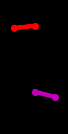
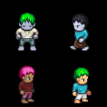
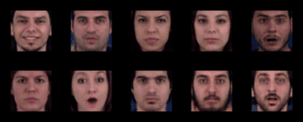

# DisentanglingSequences
Repo for the work on hierarchical state space models for disentanglement

##  Generation Samples

Note that these are random samples, so there may be inactive GIFs if the action is neutral.

Pendulum swings (60 timesteps)

  

Animated Sprites [1] (8 timesteps)

MUG-FED [2] (16 timesteps)

##  References

[1] http://gaurav.munjal.us/Universal-LPC-Spritesheet-Character-Generator/

[2] N. Aifanti, C. Papachristou, and A. Delopoulos. The MUG facial  expression  database.Proc.  11th  Int.  Workshop  on Image Analysis for Multimedia Interactive Services, 2010.
